# Containerized Microservice with Automated CI/CD Pipeline

## Scenario — What Problem Are We Solving?

This project simulates a problem that every engineering team eventually hits: deployments become a liability.

When updates are deployed manually, every release carries human risk. Someone has to SSH into a server, pull the latest code, restart a process, and confirm nothing broke. That works once. It does not work when a team is shipping updates daily, when multiple engineers are involved, or when a deployment happens at the wrong moment and takes a service down. There is no audit trail, no automatic rollback, and no consistent process from one deployment to the next.

The goal of this project was to eliminate manual deployments entirely. I containerized a Flask application using Docker, stored container images in Amazon ECR, and built a GitHub Actions pipeline that automatically builds, pushes, and deploys a new version to ECS Fargate every time code is pushed to the main branch. A deployment now takes the same steps, in the same order, every single time, with no human involvement after the push. If a deployment fails a health check, ECS rolls it back automatically.

This is my third AWS project and the most complex build I have done so far. Project 2 taught me Terraform and three-tier infrastructure. This one adds containers, a private networking layer, automated deployments, and zero stored credentials. I will be honest: there was a meaningful jump in complexity between the two. This documentation reflects the actual build, including where I got stuck and what I learned.

---

## Architecture

The application runs on Amazon ECS Fargate inside private subnets with no public IP addresses assigned. All inbound traffic enters through an Application Load Balancer sitting in public subnets. The ALB is the only entry point from the internet. Container images are stored in Amazon ECR and pulled by ECS during each deployment.

For outbound access from the private subnets (pulling images, sending logs to CloudWatch), a NAT Gateway handles the routing without exposing the containers to the internet directly.

The deployment pipeline works like this: a push to the main branch on GitHub triggers GitHub Actions. The workflow authenticates to AWS using OIDC with no stored credentials, builds a new Docker image tagged with the commit SHA, pushes it to ECR, and tells ECS to deploy it using a rolling update strategy. If the new containers fail their health checks, ECS rolls back to the previous version automatically.

```
Traffic flow:      User → ALB (public subnets) → ECS Fargate tasks (private subnets, no public IP)
Deployment flow:   GitHub push → OIDC auth → Docker build → ECR push → ECS rolling deploy
Outbound access:   ECS tasks → NAT Gateway → internet (image pulls, log delivery)
```

---

## AWS Services Used

- **Docker** — packages the Flask application and all its dependencies into a container image that runs identically in every environment
- **Amazon ECR** — private container registry that stores every image version with vulnerability scanning on every push and a lifecycle policy keeping the last 10 images
- **Amazon ECS Fargate** — runs the containers without requiring server management; AWS handles the underlying compute and I define what runs on it
- **Application Load Balancer** — the single controlled entry point for all internet traffic; routes requests to healthy containers and performs health checks before sending traffic to a new deployment
- **Amazon VPC** — isolated network with public subnets for the ALB and private subnets for the ECS tasks, with a NAT Gateway providing outbound access from the private layer
- **AWS IAM** — two separate roles: one for the ECS control plane (pulling images, writing logs) and one for the application runtime; plus a GitHub Actions OIDC role scoped to this specific repository and the main branch only
- **GitHub Actions** — the CI/CD pipeline that automates the entire build and deployment process on every push with no manual steps
- **Amazon CloudWatch** — collects container logs with a 30-day retention policy and monitors ALB error rates and ECS task counts with SNS alerting
- **Amazon SNS** — sends email alerts when CloudWatch thresholds are exceeded
- **Amazon S3** — remote Terraform state storage with a new key for this project's state file
- **Terraform** — all 36 resources defined and deployed as Infrastructure as Code

---

## Obstacles — Constraints and Security Requirements

**ECS tasks must never have a public IP address.**
Assigning a public IP to a compute resource means it is reachable from the internet, even if nothing is intentionally listening on it. In this architecture, ECS tasks live in private subnets and the option to assign a public IP is disabled at the resource level. The only way to reach the application is through the ALB. Someone who discovers a container's IP address gets nowhere because there is no network path to it from the internet.

**No AWS credentials are stored anywhere in GitHub.**
The most common CI/CD security mistake is storing an AWS access key as a GitHub secret. If that key is ever exposed, anyone who has it can act as that IAM user until the key is manually rotated. This pipeline uses IAM OIDC instead. When GitHub Actions runs, it proves its identity to AWS using a short-lived cryptographic token and receives temporary credentials scoped to exactly what the pipeline needs. There is no long-lived secret to rotate, leak, or forget about.

**The OIDC trust policy is scoped to this repository and the main branch only.**
It is not enough to trust GitHub as an identity provider broadly. The trust policy in this project specifies the exact repository and the exact branch allowed to authenticate. A workflow running from a forked repository or a different branch cannot assume this role. The scope of any potential compromise is limited before anything can go wrong.

**Two separate IAM roles handle two separate jobs.**
The ECS execution role is what the ECS control plane uses to pull container images from ECR and send logs to CloudWatch. The ECS task role is what the Flask application itself uses at runtime. Combining them into one role would mean a vulnerability in the application could potentially be used to access infrastructure-level permissions. Keeping them separate enforces least privilege at both levels independently.

**Container images are scanned for vulnerabilities on every push.**
Every image pushed to ECR is automatically scanned against a database of known vulnerabilities. This does not replace a full security program, but it does mean issues in the base image or installed packages are flagged immediately rather than discovered later in production.

**The Dockerfile runs the application as a non-root user.**
By default, processes inside a Docker container run as root. If an attacker exploits a vulnerability in the application, root access inside the container makes further damage significantly easier. Running as a dedicated non-root user limits what a compromised container can actually do.

**Deployment failures roll back automatically.**
ECS is configured with a circuit breaker that monitors the health of newly deployed containers. If a deployment fails its health checks, ECS stops the rollout and reverts to the previous working version without any manual intervention needed. A bad deployment does not stay bad.

---

## Actions — What Was Built and Why
### Step 1 — Flask Application and Dockerfile

All work in this step runs locally on my Mac. Docker Desktop needs to be open and running before any docker commands will work. The whale icon in the menu bar confirms the engine is active.

I verified Docker was installed and working by running two commands in my terminal. The first confirmed the version. The second pulled the hello-world image from Docker Hub and ran it as a container, printing a confirmation message that the installation was successful.

<div align="center">
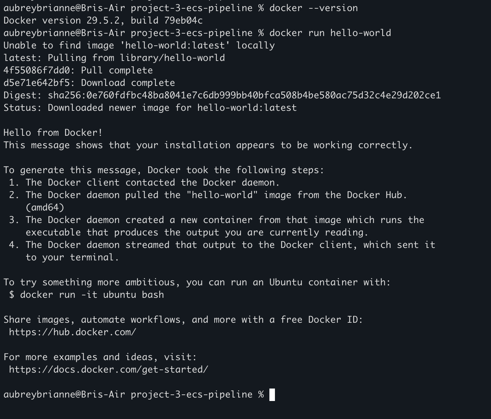
</div>

With Docker confirmed, I opened my terminal and created the project directory:

```bash
mkdir project-3-ecs-pipeline && cd project-3-ecs-pipeline
```

I then opened the entire project folder in VS Code:

```bash
code .
```

Inside VS Code I created four files directly from the sidebar: app.py, requirements.txt, .dockerignore, and Dockerfile.

<div align="center">
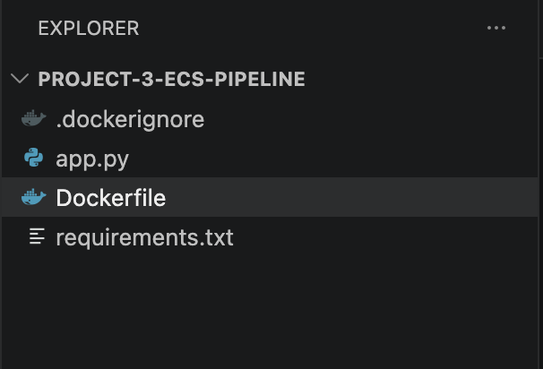
</div>

**app.py** is a minimal Flask application with two endpoints. The root endpoint returns a JSON status response. The /health endpoint is what the ALB uses to verify the container is healthy before routing traffic to it. The application listens on 0.0.0.0 so it accepts connections from any network interface inside the container.

**requirements.txt** contains a single dependency. Flask is pinned to version 3.0.3 so every build installs the exact same package rather than pulling whatever the latest version happens to be at build time.

**.dockerignore** tells Docker what to exclude when building the container image. The .git folder, Terraform files, and the README have no business being inside a running container. Excluding them keeps the image smaller and avoids accidentally copying sensitive values into it.

**Dockerfile** builds the container image with security decisions built in from the start. It uses python:3.12-slim as the base image with a pinned version rather than :latest. It creates a non-root user called appuser and runs the application as that user rather than root. Dependencies are installed before the application code is copied so Docker can cache that layer. If only app.py changes on a future build, pip does not reinstall everything from scratch. A built-in health check runs every 30 seconds so ECS knows whether the container is actually healthy, not just running.

I verified the application ran correctly by starting it locally and hitting both endpoints:

<div align="center">
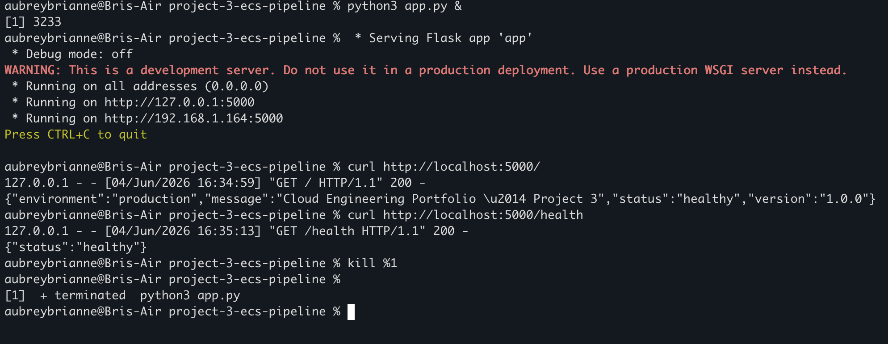
</div>

### Step 2 — Remote State S3 Bucket

Before running Terraform, I created the S3 bucket that stores the Terraform state file remotely. This has to be done manually because Terraform cannot create the bucket it needs to store its own state. It is a dependency that has to exist first.

I created the bucket and enabled versioning in a single command:

```bash
aws s3 mb s3://brianne-terraform-state-2026 --region us-east-1 && aws s3api put-bucket-versioning --bucket brianne-terraform-state-2026 --versioning-configuration Status=Enabled
```

Versioning means previous state file versions can be recovered if anything gets corrupted. Public access is blocked by default on all new S3 buckets in AWS so no additional configuration was needed there.

I confirmed the bucket was created and versioning was enabled directly from the terminal rather than clicking through the console.

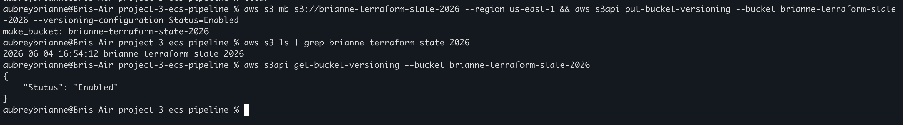

### Step 3 — Terraform Project Structure

With the S3 backend in place, I created the five Terraform configuration files inside the same project directory: providers.tf, variables.tf, terraform.tfvars, main.tf, and outputs.tf. All five were created directly in VS Code from the sidebar and follow the same structure as Project 2. The one thing worth calling out is that terraform.tfvars is blocked by .gitignore before the very first commit so sensitive values never make it to GitHub. A full explanation of each file's purpose is documented in the Project 2 README.

<div align="center">
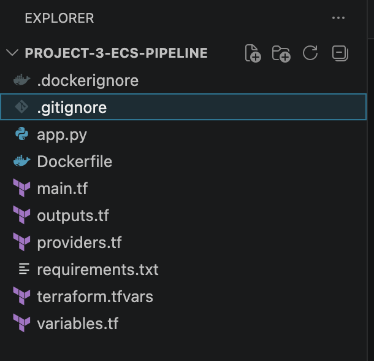
</div>

### Step 4 — Infrastructure Deployment with Terraform

With all five files written and the S3 backend in place, I ran terraform init to initialize Terraform, download the AWS provider plugin, and connect to the remote backend.

<div align="center">
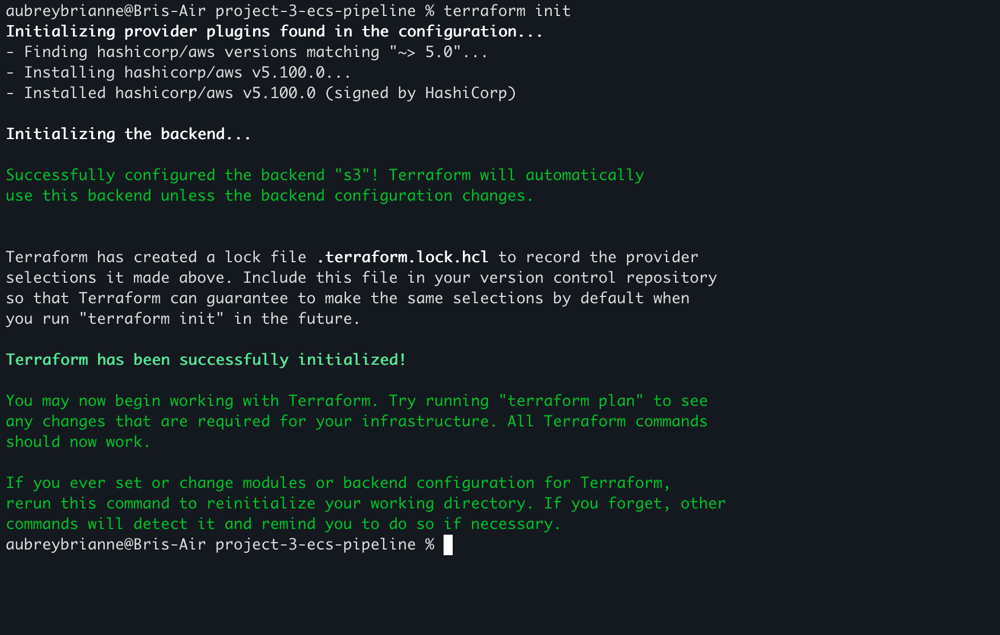
</div>

terraform plan validated 37 resources to be created across the full stack. I reviewed the plan before applying to confirm every resource matched what was designed.

<div align="center">
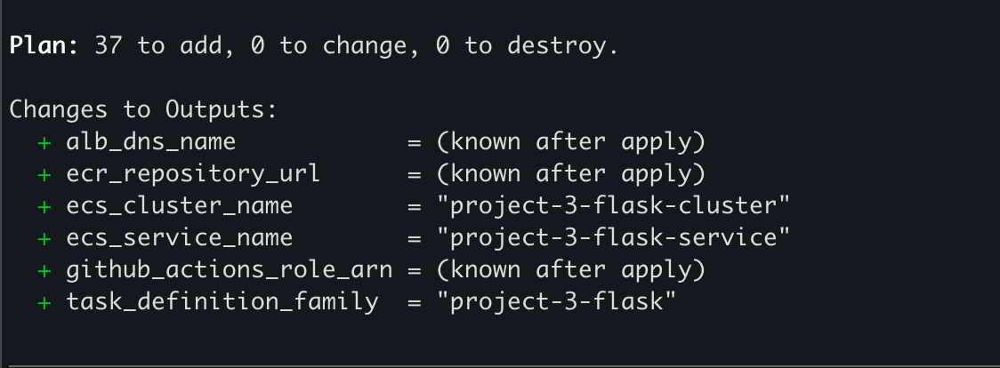
</div>

Running terraform apply provisioned everything in a single command: VPC, public and private subnets across two availability zones, internet gateway, NAT gateway, route tables, security groups, ECR repository with vulnerability scanning, IAM roles, ALB, ECS cluster, ECS task definition and service, CloudWatch log group, SNS topic, and two CloudWatch alarms.

<div align="center">
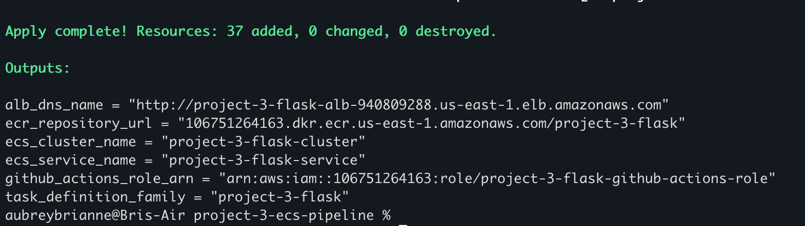
</div>

### Step 5 — Bootstrap: First Image Push and Service Scale

With the infrastructure live, the ECS service existed but was running zero tasks. The task definition was pointing to a placeholder Python image with no Flask app in it. Before the GitHub Actions pipeline could take over, I needed to push the real Flask image to ECR and update the task definition to use it.

I set the ECR URL as a variable in my terminal to avoid retyping the full registry path on every command:

```bash
ECR_URL="YOUR-ACCOUNT-ID.dkr.ecr.us-east-1.amazonaws.com/project-3-flask"
```

I authenticated Docker to ECR using the AWS CLI:

```bash
aws ecr get-login-password --region us-east-1 | docker login --username AWS --password-stdin $ECR_URL
```

I built the Flask image locally and tagged it as bootstrap to distinguish it from images the pipeline would push later:

```bash
docker build -t $ECR_URL:bootstrap .
```

I pushed the image to ECR:

```bash
docker push $ECR_URL:bootstrap
```

I then registered a new task definition revision pointing to the bootstrap image and forced the ECS service to deploy it with a desired count of 2:

```bash
aws ecs update-service \
  --cluster project-3-flask-cluster \
  --service project-3-flask-service \
  --task-definition project-3-flask \
  --desired-count 2 \
  --force-new-deployment
```

Once both tasks passed their health checks and showed as running, I opened the ALB DNS URL in a browser and confirmed the Flask application was live and serving traffic.

<div align="center">
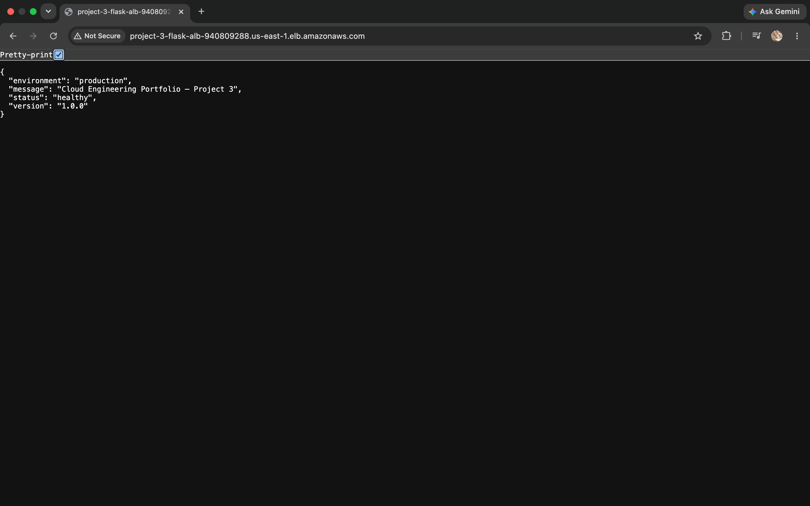
</div>

The ECS service confirmed both tasks were running and the deployment status showed as successful.

<div align="center">
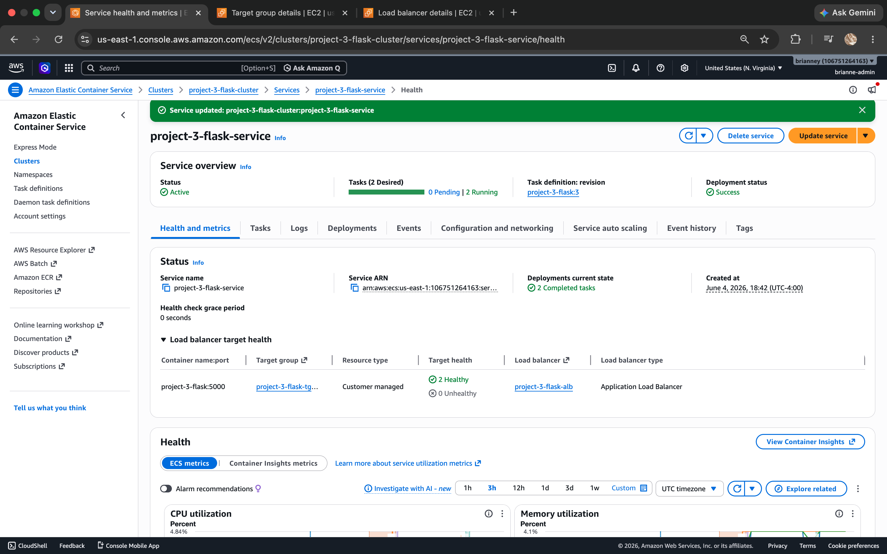
</div>

The ALB target group showed both tasks registered as healthy across two availability zones, confirming the load balancer was actively routing traffic to the containers.

<div align="center">
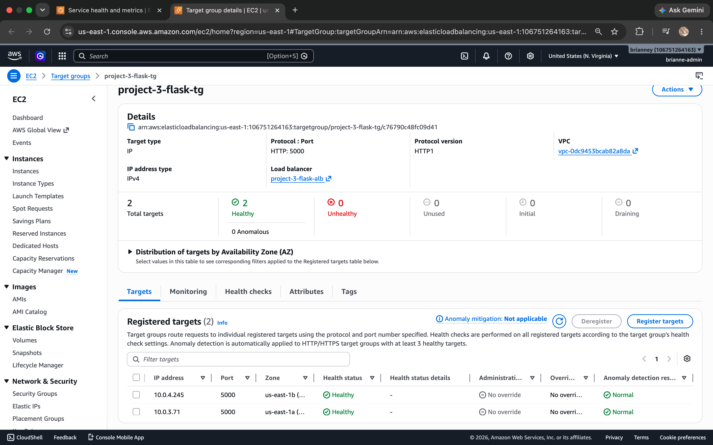
</div>

### Step 6 — GitHub Actions Deployment Workflow

With the bootstrap complete and the application live, the next step was setting up the pipeline that would automate every future deployment. From this point forward, pushing code to the main branch is the only manual step required. Everything else happens automatically.

Before creating the workflow file I added one secret to the GitHub repository. Under Settings > Secrets and variables > Actions I added AWS_ROLE_ARN with the GitHub Actions role ARN from the Terraform outputs. This is the only credential the pipeline needs. There is no AWS access key and no secret key stored anywhere.

I created the workflow file directly on GitHub at .github/workflows/deploy.yml. The pipeline has seven steps:

1. Check out the repository code
2. Authenticate to AWS using OIDC with no stored credentials
3. Log Docker into ECR using the authenticated session
4. Build the Docker image tagged with the commit SHA and push it to ECR
5. Download the current ECS task definition from AWS
6. Inject the new image URI into the task definition
7. Deploy the updated task definition to ECS using a rolling update and wait for stability

The first pipeline run failed immediately because my local project code had not been pushed to GitHub yet. The workflow file existed but the Dockerfile, app.py, and every other file were still only on my Mac. GitHub Actions had nothing to build from.

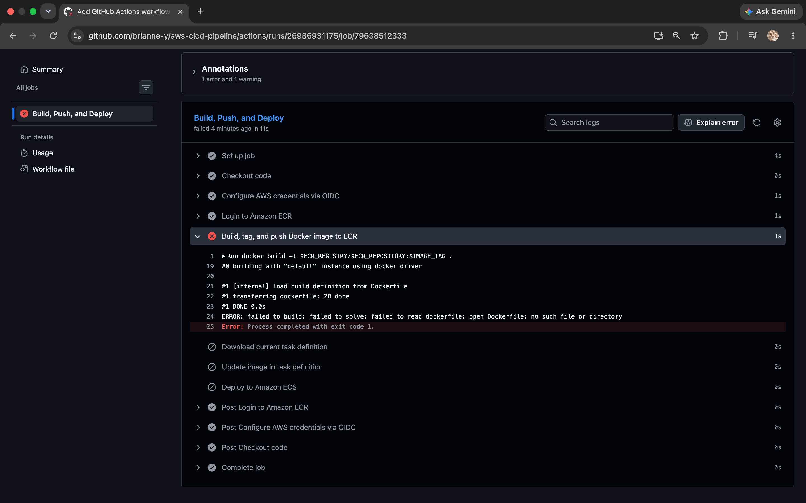

I pushed the local code to GitHub:

```bash
git add .
git commit -m "Initial commit: Flask app, Dockerfile, and Terraform infrastructure"
git push -u origin main
```

That push triggered a second pipeline run automatically. This time all seven steps completed successfully in 3 minutes and 21 seconds.

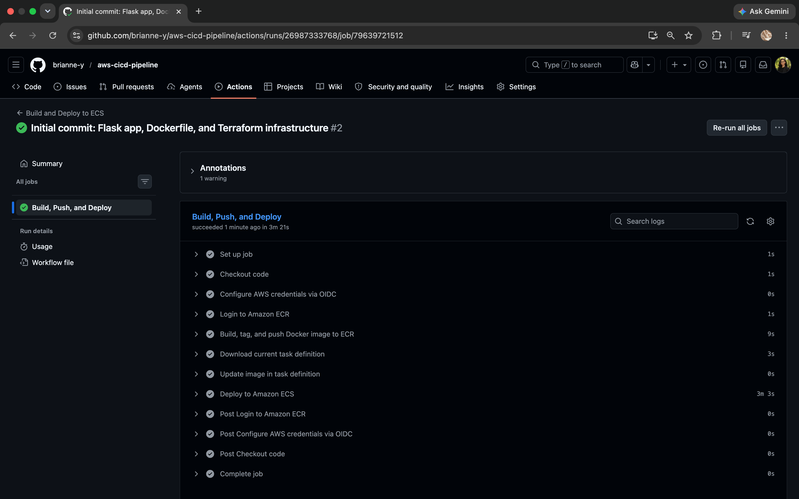

### Step 7 — Trigger and Verify the Pipeline

To confirm the pipeline was working end to end I made a small change to the message in app.py and pushed it to GitHub. That push automatically triggered the pipeline without any manual steps.

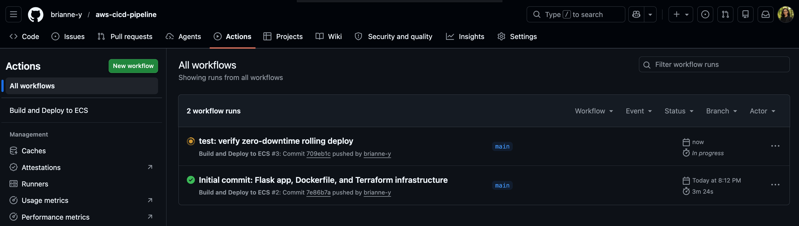

The pipeline built a new Docker image tagged with the commit SHA, pushed it to ECR, downloaded the current task definition, injected the new image URI, and deployed it to ECS using a rolling update. New containers started with the updated image, passed their health checks, and only then did ECS stop the old containers. The application never went down during the swap.

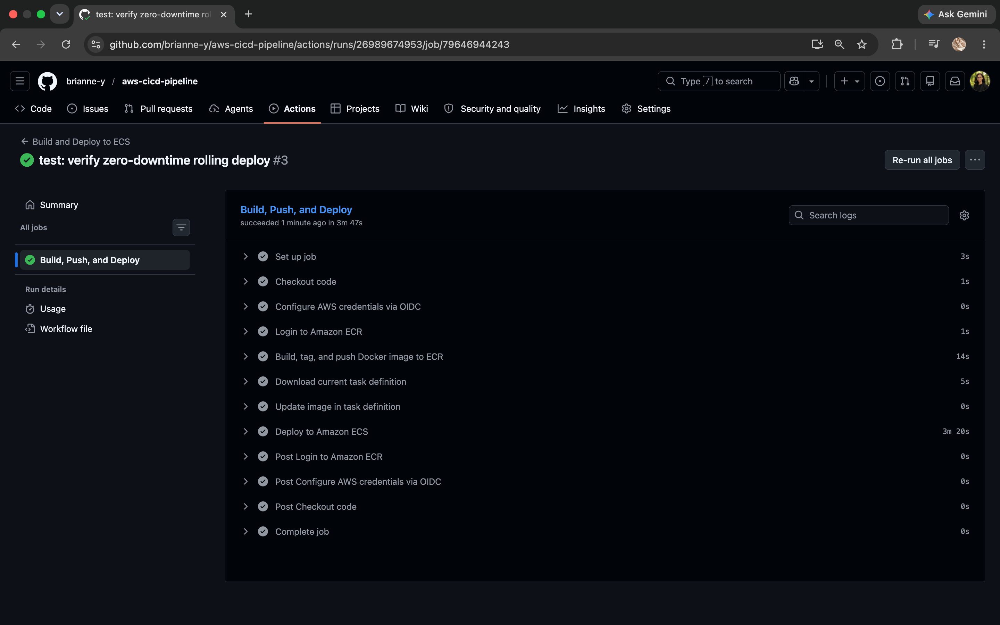

Once the pipeline completed I refreshed the ALB URL in the browser and confirmed the updated message was live.

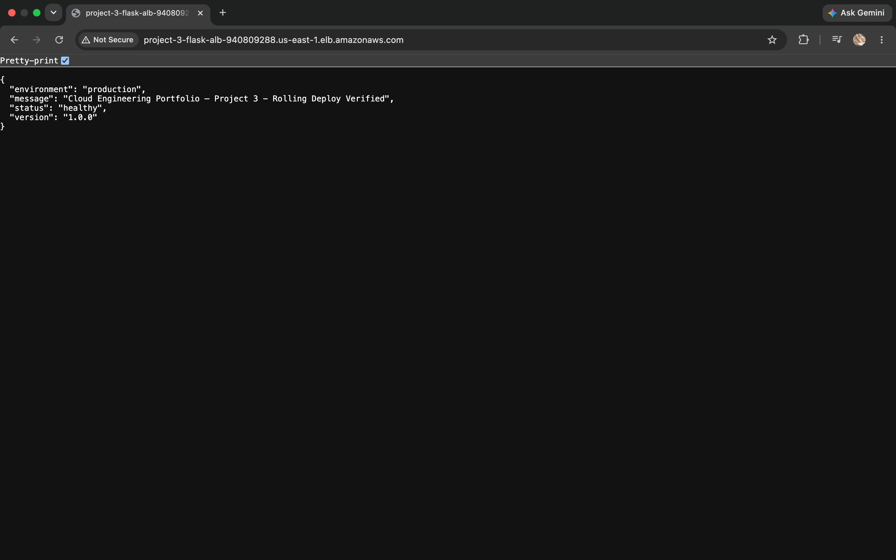

The entire process from git push to live deployment took under four minutes with zero manual steps after the push.

### Step 8 — Architecture Verification

Building the infrastructure is not enough. I ran several tests to confirm every security control is actually enforced and not just configured.

**Test 1: Flask application loads through the ALB URL**
Confirmed in Step 5, the Flask application loads through the ALB URL with no issues.

**Test 2: ECS tasks have no public IP addresses**
I ran a CLI command against the running tasks and confirmed there is no publicIpv4Address field on the network interface. The only address assigned is a private IP in the 10.0.x.x range inside the VPC.

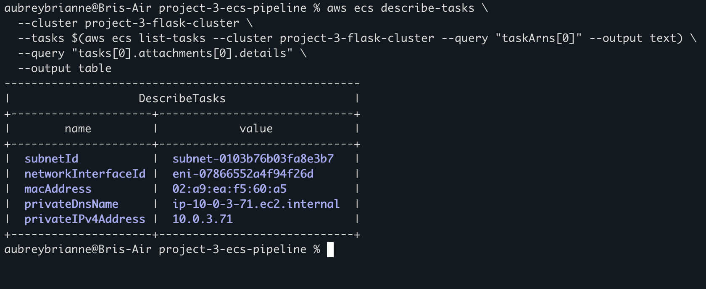

I then attempted to connect directly to that private IP from my Mac terminal. The connection timed out as expected. There is no network path from the internet to the ECS tasks directly.

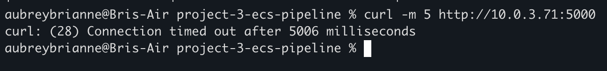

**Test 3: ECR repository has vulnerability scanning enabled**
I confirmed scan_on_push is set to true on the ECR repository. Every image pushed triggers an automatic scan against a database of known vulnerabilities.

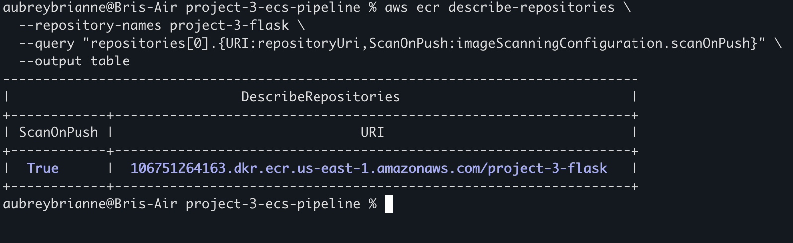

The scan results showed several vulnerabilities in Perl packages bundled inside the base Python image. These are not vulnerabilities in the Flask application itself. They are OS level packages that came with python:3.12-slim. In a production environment this would be addressed by switching to a more minimal base image or setting up automated alerts for critical findings. For this project it confirms the scanning is working as designed.

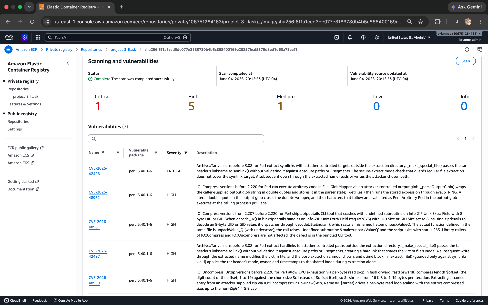

**Test 4: VPC network separation confirmed**
The VPC resource map confirms the private subnets route through the NAT Gateway for outbound access only, and the public subnets route through the internet gateway. There is no direct route from the internet to the private subnets where the ECS tasks live.

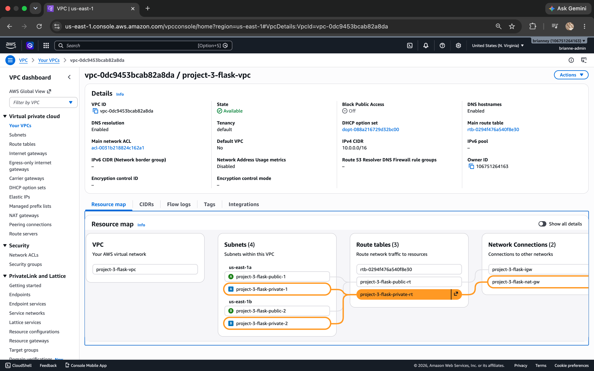

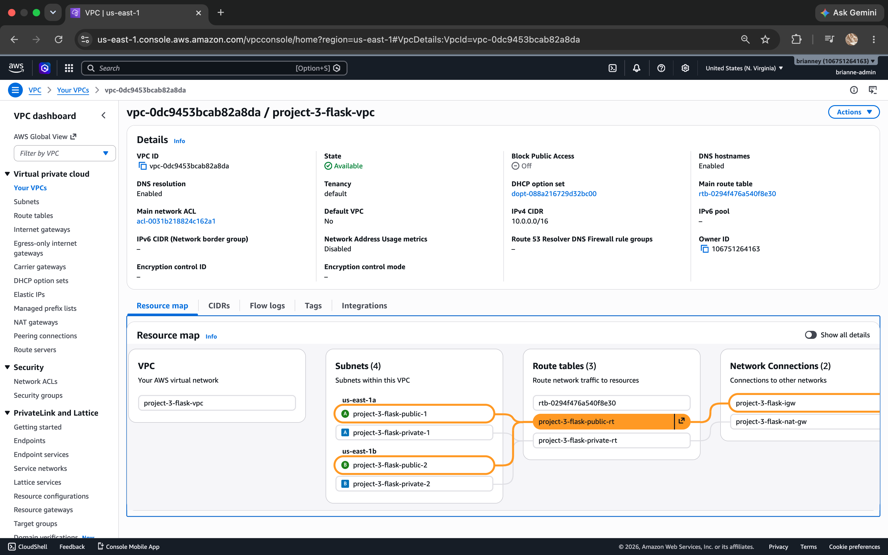

### Step 9 — CloudWatch Logs and Monitoring

With the application running I verified that logs were being collected and alarms were active.

I opened CloudWatch Log Insights and ran a query against the /ecs/project-3-flask log group to pull the 20 most recent log entries. The results showed the ALB health check hitting the /health endpoint every 30 seconds, confirming the container was actively serving traffic and logging every request.

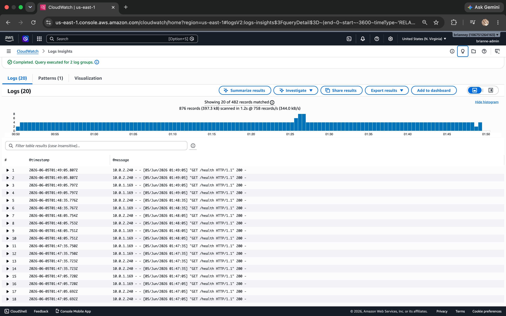

Drilling into a single log entry confirms the ALB health check is hitting the /health endpoint every 30 seconds and receiving a 200 response back from the container, proving the application is actively serving traffic.

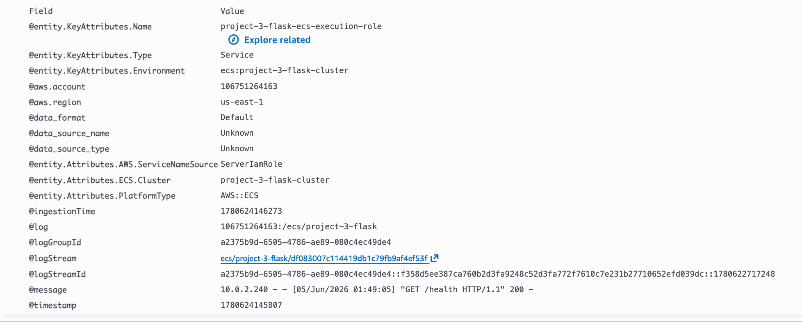

Both CloudWatch alarms were confirmed active and in OK state — one monitoring ALB 5xx error rates and one monitoring ECS running task count.

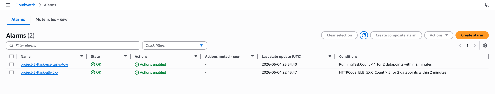

To verify the alerting pipeline worked end to end I scaled the ECS service to zero tasks intentionally. The ECS tasks low alarm triggered within two minutes and an email notification arrived via SNS confirming the full observability stack was working.

<div align="center">
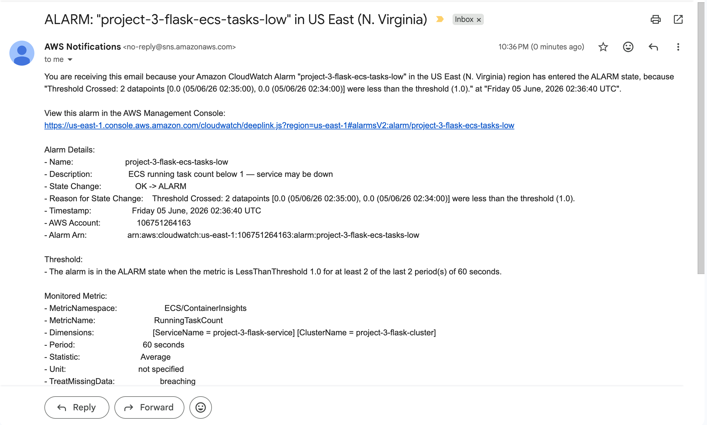
</div>

## Results — What the Working System Demonstrates

The Flask application loads through the ALB DNS URL. ECS Fargate tasks have no public IP addresses and are unreachable from the internet directly. Every deployment happens automatically on a git push with no manual steps after the code is pushed. A bad deployment rolls back automatically without human intervention.

The entire infrastructure was provisioned from code with a single terraform apply command across 37 resources and can be fully torn down with a single terraform destroy. The GitHub Actions pipeline authenticated to AWS without a single stored credential using OIDC. Every container image in ECR is tagged with the exact commit SHA that produced it, creating a full audit trail from code to production.

This project demonstrated that automation and security are not competing priorities. The pipeline that removed human effort from deployments is the same pipeline that enforced consistent security controls on every single build.

## Troubleshooting — Real Issues Encountered and Resolved

**Issue 1 — IndentationError in app.py**
When I first ran the Flask application locally, Python threw an IndentationError pointing to line 6. The error message said "expected an indented block after function definition on line 5." The root cause was a missing or incorrect indentation on the return statement inside the home() function. Python cannot run a file with a syntax error so the fix had to happen before anything else. I corrected the indentation in VS Code and the application ran successfully on the next attempt.

**Issue 2 — ECS tasks crashing on startup**
After scaling the service to 2 tasks, all tasks showed as stopped in the ECS console. The root cause was that the task definition was still pointing to the placeholder Python image with no Flask app and nothing listening on port 5000. The ALB health check hit /health, got no response, and ECS stopped the task. The fix was registering a new task definition revision pointing to the real bootstrap image in ECR and forcing a new deployment. Once the correct image was deployed both tasks came up healthy.

**Issue 3 — GitHub Actions pipeline failed on first run**
The first pipeline run failed with "open Dockerfile: no such file or directory." The workflow file existed on GitHub but the actual project code had never been pushed. GitHub Actions had nothing to build from. The fix was pushing the local project folder to GitHub first, which triggered a second pipeline run automatically. That run succeeded with all seven steps completing in 3 minutes and 21 seconds.

**Issue 4 — Git push rejected with authentication failed**
The first attempt to push local code to GitHub failed with "Authentication failed." GitHub no longer accepts account passwords for Git operations over HTTPS. The fix was generating a classic Personal Access Token scoped to repo permissions and using that as the password instead. The push succeeded immediately after.

**Issue 5 — Git push rejected with fetch first**
After generating the token, the push was rejected because the remote repository had the workflow file that was created directly on GitHub and my local machine did not have it. Running git pull origin main with rebase pulled the remote changes first and the subsequent push succeeded.

**Issue 6 — terraform destroy blocked by non-empty ECR repository**
Running terraform destroy completed most of the infrastructure but failed at the ECR repository because it contained images. Terraform will not delete a non-empty ECR repository by default. I deleted the images manually through the ECR console and ran terraform destroy again. The second run completed with the remaining resources destroyed.

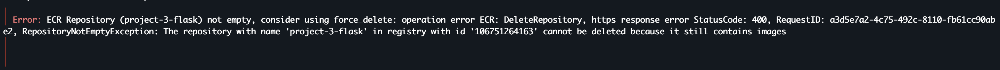


## Security Implementation Summary

| Layer | Control | Purpose |
|-------|---------|---------|
| ECS | assign_public_ip = false | Tasks are unreachable from the internet directly |
| ECS | Tasks in private subnets | No network route from the internet to the compute layer |
| ECS | Deployment circuit breaker | Failed deployments roll back automatically |
| IAM | OIDC authentication | No stored AWS credentials anywhere in the pipeline |
| IAM | OIDC scoped to repo and branch | Only this repository on the main branch can authenticate |
| IAM | Separate execution and task roles | Control plane permissions isolated from application runtime |
| ECR | scan_on_push = true | Every image scanned for vulnerabilities on every push |
| ALB | Single entry point | All internet traffic enters through the ALB only |
| Git | terraform.tfvars in .gitignore | Sensitive values never committed to GitHub |


## Key Learnings

- Automation and security are not competing priorities. The pipeline that removed manual effort from deployments is the same pipeline that enforced consistent security controls on every single build. Removing the human from the deployment process also removed the human error.

- Two IAM roles are better than one. Separating the ECS execution role from the ECS task role means a vulnerability in the application cannot be used to access infrastructure level permissions. Least privilege at both layers independently is more secure than least privilege at one combined layer.

- OIDC is worth the setup complexity. Configuring the trust policy takes more work upfront than dropping an access key into a GitHub secret, but the result is a pipeline with no long lived credentials to rotate, leak, or forget about. The security profile is permanently better.

- The task definition is the source of truth for what runs in production. Understanding that ECS pulls instructions from the task definition, not from whatever image happens to be in ECR, was the key to diagnosing why tasks were crashing during the bootstrap phase.

- Read the error message before doing anything else. Every issue in this build was resolved by reading what the terminal actually said and finding the root cause rather than guessing. The GitHub Actions error said the Dockerfile was missing. The ECS console showed tasks stopping immediately. The git error said fetch first. Each message pointed directly to the fix.

## Cleanup — Avoid Unnecessary AWS Charges

**Important:** ECR must be emptied before running terraform destroy. Terraform will not delete a non-empty ECR repository and the destroy will fail partway through, leaving orphaned resources running in AWS.
Delete all images from the ECR repository in the AWS console first, then run terraform destroy from your terminal.

<div align="center">
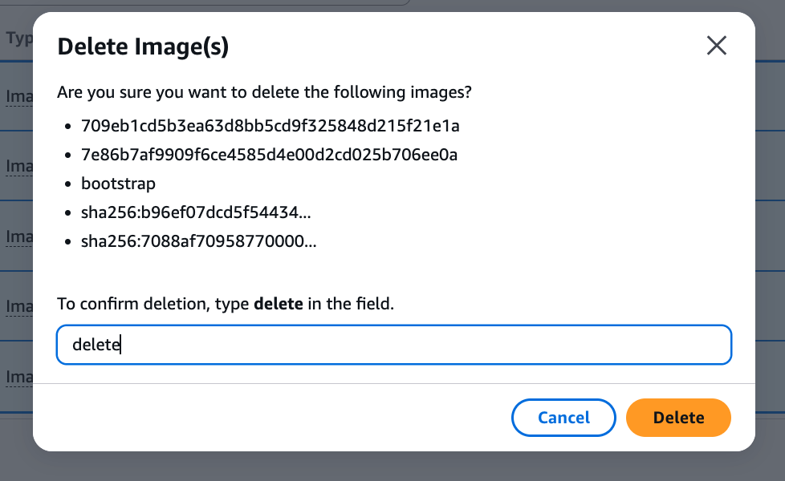
</div>


<div align="center">
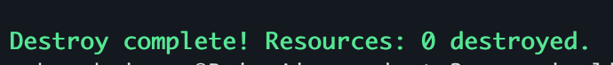
</div>

All VPC, ECS, ALB, ECR, IAM, and CloudWatch resources are now removed by terraform destroy once the ECR repository is empty.

## Let's Connect!

Brianne Young | Cloud Engineer | [LinkedIn](https://www.linkedin.com/in/brianne-young0/) | [GitHub](https://github.com/brianne-y)
